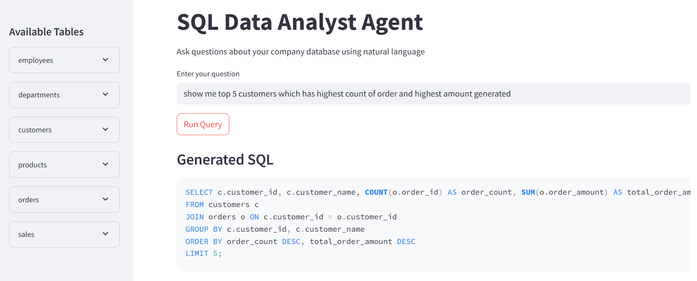
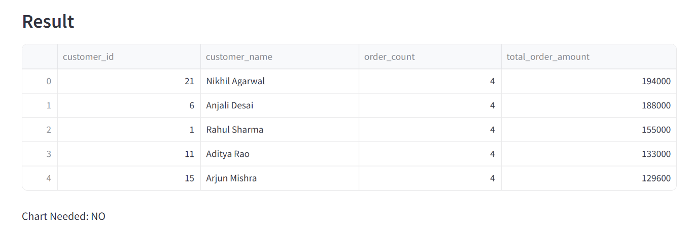

# SQL Data Analyst Agent


### RESULT


## Overview

SQL Data Analyst Agent is an AI-powered project that allows users to ask questions about company data in natural language.

Instead of writing SQL queries manually, the user can ask questions like:

- Top 5 employees with highest salary
- Show total sales by region
- Department wise average salary
- Top customers by revenue
- Show total orders by product category

The application automatically:

1. Understands the user question
2. Converts it into SQL query using LLM
3. Executes the query on MySQL database
4. Displays the result in a dataframe
5. Decides whether a chart is needed
6. Generates chart automatically when required

---

## Features

- Natural language to SQL conversion
- MySQL database integration
- Automatic SQL execution
- Pandas dataframe output
- Automatic chart generation
- LangChain integration
- LangGraph workflow
- Streamlit user interface
- Sidebar showing available tables and columns

---

## Technologies Used

- Python
- MySQL
- SQLAlchemy
- Pandas
- Matplotlib
- Streamlit
- LangChain
- LangGraph
- Ollama
- Llama3

---

## Project Workflow

User Question  
↓  
LLM Generates SQL Query  
↓  
SQL Executes On MySQL Database  
↓  
Result Loaded Into Pandas DataFrame  
↓  
LLM Decides Whether Chart Is Needed  
↓  
Chart Generated If Required  
↓  
Final Output Displayed In Streamlit UI

---

## Database Tables Used

### employees
- employee_id
- employee_name
- age
- gender
- department_id
- salary
- joining_date
- city

### departments
- department_id
- department_name

### customers
- customer_id
- customer_name
- city

### products
- product_id
- product_name
- category
- price

### orders
- order_id
- customer_id
- product_id
- quantity
- total_amount
- order_date

### sales
- sale_id
- employee_id
- product_name
- sale_amount
- sale_date
- region

---

## Example Questions

- Top 5 employees with highest salary
- Show total sales by region
- Show department wise average salary
- Top 5 customers by revenue
- Show total sales by product
- Show monthly sales trend

---

## Installation

Clone the repository:

```bash
git clone <your-github-repo-link>
